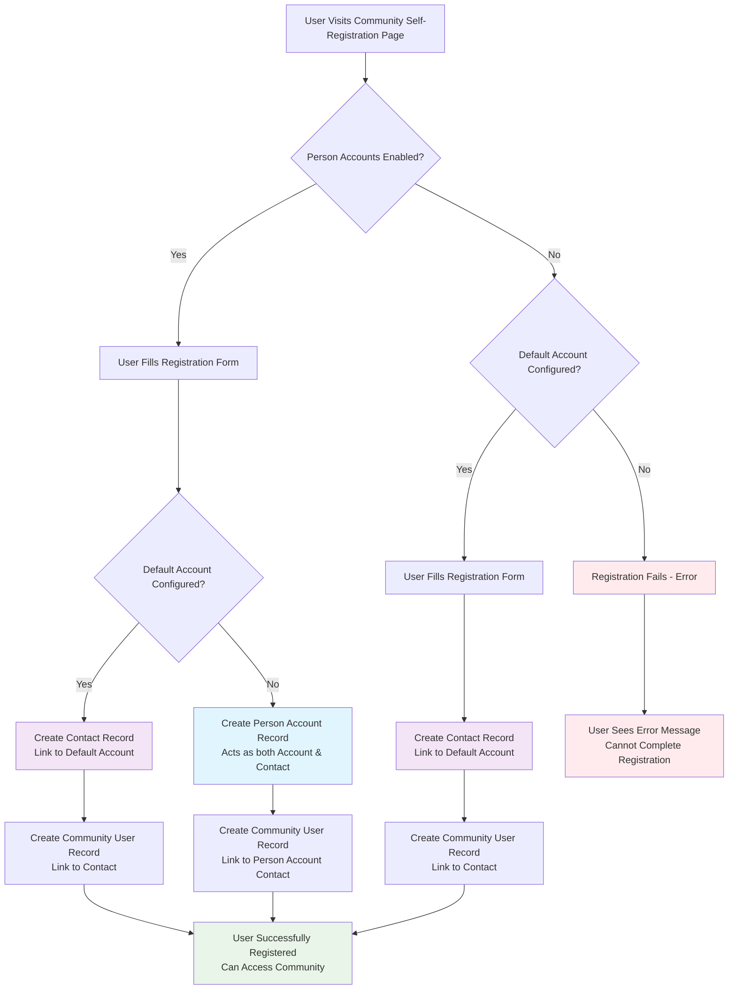

I'll create a mermaid diagram showing the Salesforce Experience Cloud (Community) self-registration process and how contacts and person accounts are created/needed.This diagram illustrates the Salesforce Experience Cloud self-registration process and shows:

**Key Decision Points:**
1. **Person Accounts Enabled** - Determines available options
2. **Default Account Configured** - Affects how accounts/contacts are created

**Possible Outcomes:**
- **Person Account Creation** (blue) - When Person Accounts are enabled and no default account is configured
- **Contact with Default Account** (purple) - When a default account is specified
- **Registration Failure** (red) - When neither Person Accounts nor default account are properly configured
- **Success** (green) - User can access the community

**Important Notes:**
- Person Accounts act as both Account and Contact records
- Community users always need an Account-Contact relationship
- Without proper configuration, registration will fail
- Person Accounts provide the most flexible solution for individual customer registration

This visual shows why Person Accounts are often the preferred solution for B2C communities where customers self-register individually.

