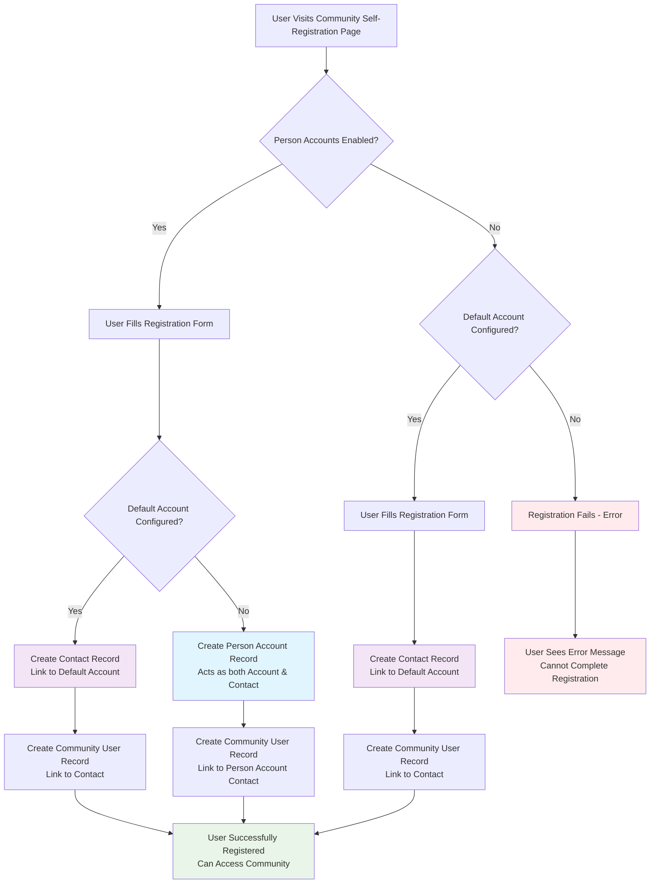

```mermaid
flowchart TD
    A[User Visits Community Self-Registration Page] --> B{Person Accounts Enabled?}
    
    B -->|Yes| C[User Fills Registration Form]
    B -->|No| D{Default Account Configured?}
    
    D -->|Yes| E[User Fills Registration Form]
    D -->|No| F[Registration Fails - Error]
    
    C --> G{Default Account Configured?}
    
    G -->|Yes| H[Create Contact Record<br/>Link to Default Account]
    G -->|No| I[Create Person Account Record<br/>Acts as both Account & Contact]
    
    E --> J[Create Contact Record<br/>Link to Default Account]
    
    H --> K[Create Community User Record<br/>Link to Contact]
    I --> L[Create Community User Record<br/>Link to Person Account Contact]
    J --> M[Create Community User Record<br/>Link to Contact]
    
    K --> N[User Successfully Registered<br/>Can Access Community]
    L --> N
    M --> N
    
    F --> O[User Sees Error Message<br/>Cannot Complete Registration]
    
    style I fill:#e1f5fe
    style H fill:#f3e5f5
    style J fill:#f3e5f5
    style F fill:#ffebee
    style N fill:#e8f5e8
    style O fill:#ffebee
```
