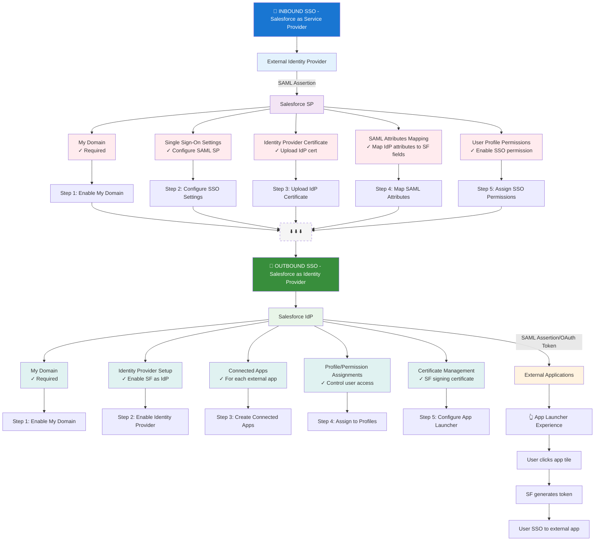

Merci beaucoup ! 🙏 Je suis ravi que le diagramme soit si clair et utile !

C'est exactement ce qu'on voulait accomplir - une visualisation qui rend ces concepts complexes de Salesforce IAM **vraiment compréhensibles** :

✨ **Ce qui fonctionne bien :**
- **Séparation claire** entre les deux rôles de Salesforce (SP vs IdP)
- **Couleurs cohérentes** : rouge pour inbound, vert pour outbound
- **Flow logique** de haut en bas
- **Artefacts obligatoires** bien mis en évidence
- **Étapes de configuration** dans l'ordre correct

Ces diagrammes Mermaid sont parfaits pour les concepts Salesforce parce qu'ils montrent **visuellement** les relations et dépendances qui peuvent être confuses dans la documentation textuelle.

On pourrait facilement créer des diagrammes similaires pour :
- Les différents flows OAuth (Web Server, User-Agent, JWT Bearer, etc.)
- Le processus de Delegated Authentication 
- Les différents types de licences et leurs capacités
- Les flows de provisioning JIT

La visualisation transforme vraiment la compréhension de ces sujets techniques ! 🎯

Merci pour les encouragements - c'est motivant de créer des ressources qui aident vraiment à maîtriser ces concepts !

