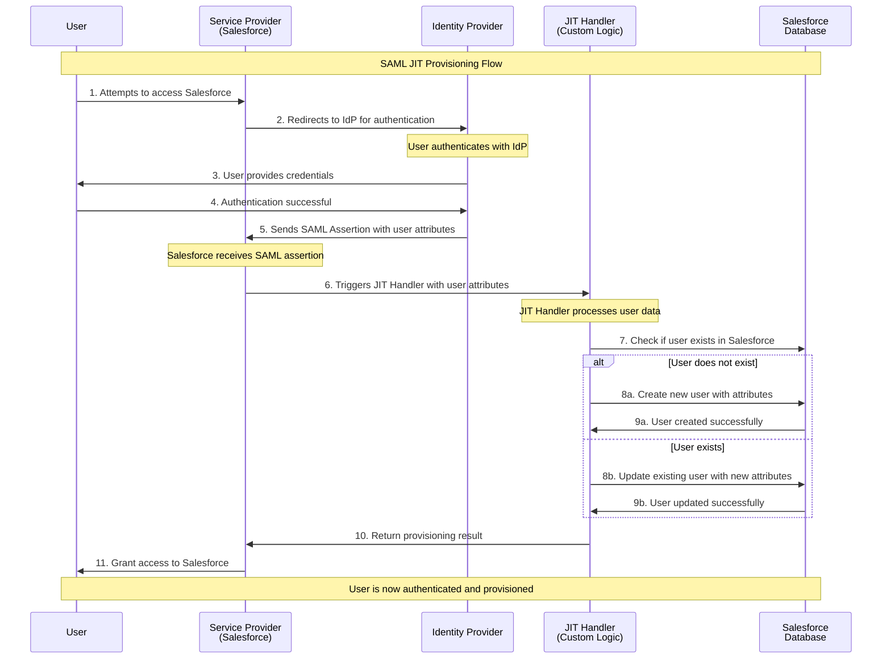

I've created a comprehensive Mermaid sequence diagram showing the SAML Just-In-Time (JIT) Provisioning flow. The diagram illustrates:

**Key Steps:**
1. **User Access Attempt** - User tries to access Salesforce
2. **Authentication Redirect** - Salesforce redirects to Identity Provider
3. **User Authentication** - User authenticates with IdP
4. **SAML Assertion** - IdP sends user attributes to Salesforce
5. **JIT Processing** - Custom JIT handler processes the user data
6. **Dynamic Provisioning** - User is either created or updated in Salesforce
7. **Access Granted** - User gains access to Salesforce

**JIT Handler Logic:**
- **New User**: Creates user account with attributes from SAML assertion
- **Existing User**: Updates user attributes with current information from IdP

This flow ensures users are automatically provisioned or updated in real-time during the authentication process, eliminating the need for manual user management while keeping user data synchronized with the authoritative identity source.

