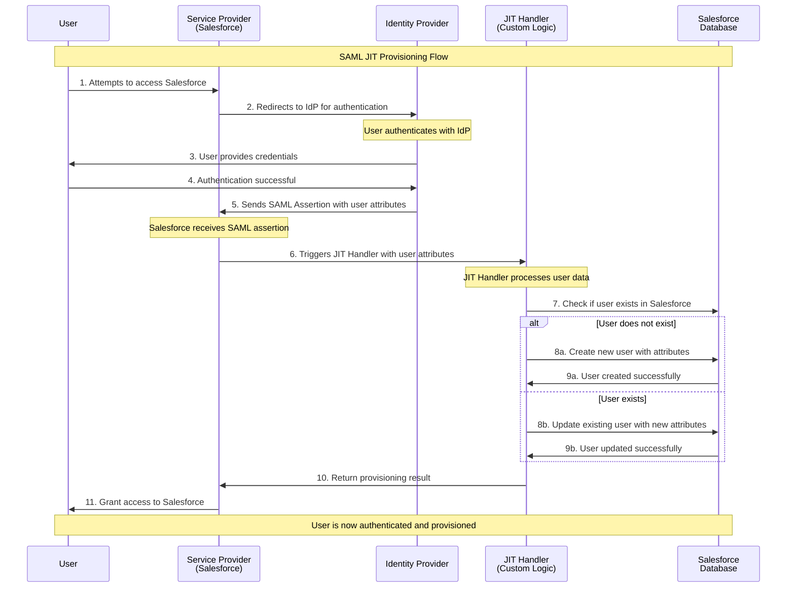

I've created a comprehensive Mermaid sequence diagram showing the SAML Just-In-Time (JIT) Provisioning flow. The diagram illustrates:

**Key Steps:**
1. **User Access Attempt** - User tries to access Salesforce
2. **Authentication Redirect** - Salesforce redirects to Identity Provider
3. **User Authentication** - User authenticates with IdP
4. **SAML Assertion** - IdP sends user attributes to Salesforce
5. **JIT Processing** - Custom JIT handler processes the user data
6. **Dynamic Provisioning** - User is either created or updated in Salesforce
7. **Access Granted** - User gains access to Salesforce

**JIT Handler Logic:**
- **New User**: Creates user account with attributes from SAML assertion
- **Existing User**: Updates user attributes with current information from IdP

This flow ensures users are automatically provisioned or updated in real-time during the authentication process, eliminating the need for manual user management while keeping user data synchronized with the authoritative identity source.


Great question! Here's how SAML triggers the JIT handler and how it's configured:

## **Configuration Steps**

### **1. Single Sign-On Settings**
In Salesforce Setup → Single Sign-On Settings:
- **Just-in-Time User Provisioning**: Enable this checkbox
- **User Provisioning Class**: Specify your custom Apex class name (e.g., `CustomJITHandler`)

### **2. SAML Identity Provider Settings**
Configure the SAML Identity Provider with:
- **Entity ID**: Identity Provider's unique identifier
- **SAML Login URL**: Where users authenticate
- **X.509 Certificate**: For validating SAML assertions
- **Attribute Mappings**: Map SAML attributes to Salesforce user fields

### **3. Custom JIT Handler Class**
Create an Apex class that implements `Auth.SamlJitHandler`:

```apex
global class CustomJITHandler implements Auth.SamlJitHandler {
    
    global User createUser(Id samlSsoProviderId, Id communityId, Id portalId,
                          String federationIdentifier, Map<String, String> attributes, String assertion) {
        // Create new user logic
        User u = new User();
        u.Username = attributes.get('email');
        u.Email = attributes.get('email');
        u.FirstName = attributes.get('firstName');
        u.LastName = attributes.get('lastName');
        // Set other required fields
        return u;
    }
    
    global User updateUser(Id userId, Id samlSsoProviderId, Id communityId, Id portalId,
                          String federationIdentifier, Map<String, String> attributes, String assertion) {
        // Update existing user logic
        User u = [SELECT Id, Email FROM User WHERE Id = :userId];
        u.Email = attributes.get('email');
        // Update other fields as needed
        return u;
    }
}
```

## **How the Trigger Works**

**Automatic Triggering:**
1. **SAML Assertion Processing** - When Salesforce receives a valid SAML assertion
2. **User Lookup** - Salesforce checks if user exists (based on Federation ID or Username)
3. **JIT Handler Invocation**:
   - If user doesn't exist → `createUser()` method called
   - If user exists → `updateUser()` method called
4. **Attribute Processing** - SAML attributes are passed to the handler
5. **User Provisioning** - Handler creates/updates user and returns User object

**Key Configuration Points:**
- **Federation ID Mapping**: Must be consistent between IdP and Salesforce
- **Attribute Mapping**: SAML attributes must map to Salesforce user fields
- **Profile Assignment**: JIT handler must assign appropriate Profile
- **Required Fields**: All required User fields must be populated

The JIT handler is automatically triggered by the SAML SSO process - no manual intervention needed once configured!
