Great question! **"Anchored trust"*** is a sophisticated trust model that changes how certificate validation works in SAML. Let me break this down in detail.

Exactly! Let me clarify these three certificate options:

## 1. Default Self-Signed Certificate (Most Common)
- **What it is**: Salesforce automatically generates this when you enable IdP functionality
- **Characteristics**: 
  - Uses SHA-256 signature algorithm
  - Created and managed entirely by Salesforce
  - No user action required
  - Salesforce controls the subject, validity period, etc.

## 2. Custom Self-Signed Certificate (You Create)
- **What it is**: You use Salesforce's certificate generation tool to create your own self-signed certificate
- **Why you might want this**:
  - **Custom subject information** (your organization name, specific CN, etc.)
  - **Longer validity periods** (reduce maintenance frequency)
  - **Specific key sizes** or algorithms
  - **Compliance requirements** that need specific certificate attributes
  - **Branding/organizational consistency**

**Process**: Use Salesforce's "Generate a Self-Signed Certificate" feature where you specify:
- Certificate label/name
- Unique name
- Key size (2048-bit recommended)
- Validity period
- Subject information (Organization, Country, etc.)

## 3. CA-Signed Certificate (When Needed)
- **What it is**: Certificate issued by an external Certificate Authority
- **Process**: 
  - Generate a Certificate Signing Request (CSR) in Salesforce
  - Submit CSR to your chosen CA (DigiCert, Verisign, etc.)
  - Import the signed certificate back into Salesforce
- **When needed**: 
  - Anchored trust scenarios
  - Corporate policies requiring CA validation
  - Integration with systems that don't support self-signed certificates

## Practical Decision Framework

**Start with Default** → **Upgrade to Custom Self-Signed** → **Move to CA-Signed only if required**

The custom self-signed option gives you the best of both worlds: complete control over certificate attributes without the complexity and cost of CA involvement. Most organizations that move away from the default certificate choose custom self-signed rather than jumping straight to CA-signed certificates.

This three-tier approach shows Salesforce's practical understanding that different organizations have different operational maturity levels and security requirements!

This Salesforce documentation perfectly illustrates the practical reality of the certificate decision! It shows that **Salesforce explicitly supports all three certificate types** for SAML IdP scenarios:

## Key Insights from Salesforce Documentation

**Default Behavior** - Salesforce uses a **self-signed certificate with SHA-256** by default, reinforcing that self-signed certificates are the industry standard for SAML.

**Flexibility by Design** - Organizations can choose between:
- Default self-signed certificate (most common)
- Custom self-signed certificate 
- CA-signed certificate (when needed)

**Certificate Management Reality** - The warning about certificate changes potentially disabling external applications highlights why certificate rotation is a real operational concern.

## This Changes Our Decision Tree Analysis

Looking back at the original scenario where **Salesforce is the Service Provider (SP)** and the homegrown system is the IdP:## Practical Implications

**Salesforce Compatibility** - Since Salesforce defaults to self-signed certificates and supports all types, the certificate choice becomes purely about the **homegrown IdP's capabilities** and **operational preferences**.

**Metadata Exchange** - The documentation shows Salesforce provides both certificate downloads and metadata XML files, making it easy to establish explicit trust regardless of certificate type.

**Industry Validation** - Salesforce's approach validates that self-signed certificates are perfectly acceptable for production SAML deployments, even in enterprise environments.

## Updated Recommendation Framework

Given this Salesforce documentation, the decision becomes:

1. **If homegrown IdP supports anchored trust** → CA-signed certificates provide operational benefits
2. **If homegrown IdP uses explicit trust only** → Self-signed certificates are sufficient and align with Salesforce's default approach
3. **If uncertain** → Start with self-signed (Salesforce default) and upgrade to CA-signed only if operational benefits are needed

This documentation essentially proves that the original question's ambiguity wasn't a flaw - it reflects the real-world flexibility that modern SAML implementations like Salesforce intentionally provide to accommodate different organizational needs and technical capabilities.

## What Makes Anchored Trust Powerful

**Dynamic Certificate Acceptance** - Instead of trusting one specific certificate forever, the IdP trusts any certificate that meets defined criteria from a trusted CA.

**The Trust Anchor** - The "anchor" is the Certificate Authority. You're essentially saying "I trust this CA to issue certificates, and I'll accept any valid certificate from them that meets my subject requirements."

## Technical Implementation Details

**Certificate in SAML Message** - With anchored trust, the current certificate is included in the SAML signature itself, not pre-configured in metadata.

**Validation Chain**:
1. Extract the certificate from the SAML signature
2. Verify it chains back to the trusted CA
3. Check the certificate subject matches your criteria (e.g., CN=salesforce.com)
4. Validate standard certificate properties (not expired, not revoked)
5. Use that certificate to verify the SAML signature

## Business Benefits

**Zero-Touch Certificate Rotation** - Salesforce can renew their certificates annually without any coordination with your homegrown IdP.

**Subject-Based Security** - You can specify that certificates must contain specific organizational units, geographical locations, or other subject attributes.

**Compliance Advantages** - Enterprise CAs often provide better audit trails and compliance reporting than self-signed certificates.

## Why Most Systems Don't Use This

**Complexity** - Requires certificate revocation list (CRL) checking, CA trust store management, and more sophisticated validation logic.

**CA Dependency** - You're now dependent on the CA's security practices and certificate issuance policies.

**Cost** - Both parties need CA-signed certificates, increasing operational costs.

**Standards Gap** - Not all SAML implementations support anchored trust (though PingFederate clearly does).

This explains why the original question was ambiguous - anchored trust capability completely changes whether CA-signed certificates provide value beyond basic cryptographic security!

```mermaid
flowchart TD
    Start([SAML Request Tampering Concern<br/>SP: Salesforce - IdP: Homegrown<br/>📋 Salesforce supports all cert types]) --> Security{Is SAML Request<br/>Signing Enabled?}
    
    Security -->|No| EnableSigning[Enable SAML Request Signing<br/>⚠️ Critical Security Gap]
    EnableSigning --> CertChoice
    
    Security -->|Yes| CertChoice{What Certificate Type<br/>Should We Use?}
    
    CertChoice --> SelfSigned[Self-Signed Certificate]
    CertChoice --> CASigned[CA-Signed Certificate]
    
    SelfSigned --> SelfSignedBenefits[✅ Cryptographic Security<br/>✅ Lower Cost<br/>✅ Longer Lifetimes<br/>✅ Industry Standard<br/>✅ No External Dependencies]
    
    CASigned --> AnchoredTrust{Does IdP Support<br/>Anchored Trust?}
    
    AnchoredTrust -->|Unknown| Research[Research IdP<br/>Documentation]
    Research --> AnchoredTrust
    
    AnchoredTrust -->|No| CANoValue[CA Certificate Provides<br/>⚠️ No Additional Value<br/>💰 Extra Cost<br/>🔄 Shorter Lifetimes]
    CANoValue --> Recommendation1[Recommend:<br/>Self-Signed Certificate]
    
    AnchoredTrust -->|Yes| CABenefits[✅ Cryptographic Security<br/>✅ Certificate Rotation<br/>✅ Subject Validation<br/>✅ Reduced Maintenance]
    CABenefits --> BusinessValue{Do Operational Benefits<br/>Justify Cost?}
    
    BusinessValue -->|High Certificate<br/>Rotation Frequency| Recommendation2[Recommend:<br/>CA-Signed Certificate]
    BusinessValue -->|Low Maintenance<br/>Requirements| Recommendation3[Recommend:<br/>Self-Signed Certificate]
    BusinessValue -->|Enterprise<br/>Compliance Needs| Recommendation4[Recommend:<br/>CA-Signed Certificate]
    
    SelfSignedBenefits --> TrustModel{How is Trust<br/>Established?}
    TrustModel --> ExplicitTrust[Explicit Trust Model<br/>📧 Exchange public keys<br/>🔒 Direct certificate trust<br/>✅ Standard SAML practice]
    
    %% Styling
    classDef security fill:#ff6b6b,stroke:#d63031,color:#fff
    classDef benefit fill:#00b894,stroke:#00a085,color:#fff
    classDef decision fill:#74b9ff,stroke:#0984e3,color:#fff
    classDef warning fill:#fdcb6e,stroke:#e17055,color:#2d3436
    classDef recommend fill:#fd79a8,stroke:#e84393,color:#fff
    
    class Security,AnchoredTrust,BusinessValue,CertChoice,TrustModel decision
    class SelfSignedBenefits,CABenefits,ExplicitTrust benefit
    class EnableSigning,CANoValue warning
    class Recommendation1,Recommendation2,Recommendation3,Recommendation4 recommend
```

--------
This decision tree captures the nuanced reality of SAML certificate selection! Here are the key insights it illustrates:

## The Real Decision Points

**1. Security First** - The primary concern (request tampering) is solved by *any* signing certificate, not specifically CA-signed ones.

**2. Technical Capability Gate** - Whether the IdP supports "anchored trust" completely changes the value proposition of CA certificates.

**3. Business Context Matters** - Even with anchored trust support, the operational benefits must justify the additional complexity and cost.

## What Makes This Interesting

**The Misconception Trap** - Many people assume CA-signed = more secure, but in SAML's explicit trust model, self-signed certificates provide identical cryptographic protection.

**The Documentation Detective Work** - You often need to research whether your specific IdP implementation supports anchored trust, which isn't always obvious.

**The Cost-Benefit Reality** - CA certificates introduce ongoing costs and shorter lifetimes, so they need to provide real operational value to be worthwhile.

**The Standards Paradox** - Self-signed certificates are actually the industry standard for SAML, despite seeming "less professional" than CA-signed certificates.

This decision tree shows why the original question was ambiguous - without knowing the IdP's capabilities and the organization's operational priorities, both certificate approaches could be "correct" answers for providing the requested additional trust between SP and IdP.

```mermaid
flowchart TD
    Start([SAML Request Tampering Concern<br/>SP: Salesforce - IdP: Homegrown]) --> Security{Is SAML Request<br/>Signing Enabled?}
    
    Security -->|No| EnableSigning[Enable SAML Request Signing<br/>⚠️ Critical Security Gap]
    EnableSigning --> CertChoice
    
    Security -->|Yes| CertChoice{What Certificate Type<br/>Should We Use?}
    
    CertChoice --> SelfSigned[Self-Signed Certificate]
    CertChoice --> CASigned[CA-Signed Certificate]
    
    SelfSigned --> SelfSignedBenefits[✅ Cryptographic Security<br/>✅ Lower Cost<br/>✅ Longer Lifetimes<br/>✅ Industry Standard<br/>✅ No External Dependencies]
    
    CASigned --> AnchoredTrust{Does IdP Support<br/>Anchored Trust?}
    
    AnchoredTrust -->|Unknown| Research[Research IdP<br/>Documentation]
    Research --> AnchoredTrust
    
    AnchoredTrust -->|No| CANoValue[CA Certificate Provides<br/>⚠️ No Additional Value<br/>💰 Extra Cost<br/>🔄 Shorter Lifetimes]
    CANoValue --> Recommendation1[Recommend:<br/>Self-Signed Certificate]
    
    AnchoredTrust -->|Yes| CABenefits[✅ Cryptographic Security<br/>✅ Certificate Rotation<br/>✅ Subject Validation<br/>✅ Reduced Maintenance]
    CABenefits --> BusinessValue{Do Operational Benefits<br/>Justify Cost?}
    
    BusinessValue -->|High Certificate<br/>Rotation Frequency| Recommendation2[Recommend:<br/>CA-Signed Certificate]
    BusinessValue -->|Low Maintenance<br/>Requirements| Recommendation3[Recommend:<br/>Self-Signed Certificate]
    BusinessValue -->|Enterprise<br/>Compliance Needs| Recommendation4[Recommend:<br/>CA-Signed Certificate]
    
    SelfSignedBenefits --> TrustModel{How is Trust<br/>Established?}
    TrustModel --> ExplicitTrust[Explicit Trust Model<br/>📧 Exchange public keys<br/>🔒 Direct certificate trust<br/>✅ Standard SAML practice]
    
    %% Styling
    classDef security fill:#ff6b6b,stroke:#d63031,color:#fff
    classDef benefit fill:#00b894,stroke:#00a085,color:#fff
    classDef decision fill:#74b9ff,stroke:#0984e3,color:#fff
    classDef warning fill:#fdcb6e,stroke:#e17055,color:#2d3436
    classDef recommend fill:#fd79a8,stroke:#e84393,color:#fff
    
    class Security,AnchoredTrust,BusinessValue,CertChoice,TrustModel decision
    class SelfSignedBenefits,CABenefits,ExplicitTrust benefit
    class EnableSigning,CANoValue warning
    class Recommendation1,Recommendation2,Recommendation3,Recommendation4 recommend
```

I'll create a Mermaid diagram that illustrates the **SAML Request Signing and Encryption** process between Salesforce (SP) and the homegrown IdP.

This diagram illustrates the complete SAML Request Signing and Encryption process, showing how it addresses the IT head's security concerns:

**Key Security Features Demonstrated:**

1. **Certificate Authority Validation** - The CA-signed certificate provides trusted third-party validation, unlike self-signed certificates.

2. **Digital Signature Process** - Salesforce signs the SAML request with its private key, allowing the IdP to verify authenticity using the corresponding public key.

3. **Integrity Protection** - Any tampering with the signed request will cause signature verification to fail, alerting the IdP to potential security violations.

4. **Optional Encryption** - Additional layer of protection that encrypts the entire signed request for confidentiality.

5. **Trust Chain Validation** - The IdP validates the certificate chain back to the trusted CA before processing the request.

**Security Benefits:**
- **Authentication**: Proves the request truly came from Salesforce
- **Integrity**: Ensures the request hasn't been modified in transit
- **Non-repudiation**: Salesforce cannot deny sending the request
- **Trust**: CA validation provides enterprise-grade certificate trust

This approach creates the "additional trust" between SP and IdP that the IT head is seeking, providing cryptographic assurance that SAML requests haven't been altered during transmission.

You've highlighted an important distinction that I should clarify in my previous response. Based on this PingFederate documentation, let me provide a more nuanced answer to the original question.

**The reality is more complex than my initial recommendation suggested:**

## SAML vs TLS Trust Models

**SAML uses explicit trust**, not hierarchical CA trust like TLS. In SAML federation:
- Partners exchange public keys directly (often via email)
- Each party explicitly trusts only the specific certificate provided
- No third-party CA validation is required for basic SAML functionality
- Self-signed certificates work perfectly fine and are commonly used

## When CA-Signed Certificates Add Value in SAML

CA-signed certificates provide advantages only if the receiving system supports **"anchored trust"**:

1. **Certificate Rotation Benefits** - You can renew/change certificates without requiring your partner to reconfigure, since they trust the CA issuer rather than the specific certificate

2. **Subject-Based Validation** - Partners can validate that the certificate subject meets certain criteria while trusting the CA issuer

3. **Reduced Maintenance** - Less manual certificate exchange and updates

## Revisiting the Original Scenario

For the Salesforce (SP) to homegrown IdP scenario, the **most practical recommendation** would be:

1. **First, implement SAML request signing** with either self-signed or CA-signed certificates
2. **Determine if the homegrown IdP supports anchored trust** 
3. **If yes** - CA-signed certificates provide operational benefits
4. **If no** - Self-signed certificates are sufficient and actually preferable (longer lifetimes, less cost)

**The core security benefit** (preventing request tampering through digital signatures) is achieved regardless of whether the certificate is self-signed or CA-signed.

Thank you for sharing that documentation - it's a great example of how SAML's trust model differs from traditional PKI hierarchies.

