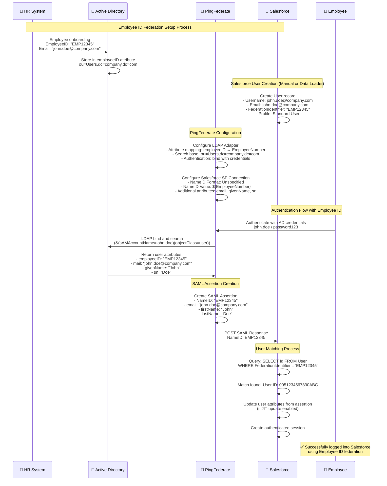

```mermaid
sequenceDiagram
    participant HR as 🏢 HR System
    participant AD as 📁 Active Directory
    participant PF as 🔐 PingFederate
    participant SF as 🏢 Salesforce
    participant User as 👤 Employee
    
    Note over HR, SF: Employee ID Federation Setup Process
    
    HR->>AD: Employee onboarding<br/>EmployeeID: "EMP12345"<br/>Email: "john.doe@company.com"
    AD->>AD: Store in employeeID attribute<br/>ou=Users,dc=company,dc=com
    
    Note over SF: Salesforce User Creation (Manual or Data Loader)
    SF->>SF: Create User record<br/>- Username: john.doe@company.com<br/>- Email: john.doe@company.com<br/>- FederationIdentifier: "EMP12345"<br/>- Profile: Standard User
    
    Note over PF: PingFederate Configuration
    PF->>PF: Configure LDAP Adapter<br/>- Attribute mapping: employeeID → EmployeeNumber<br/>- Search base: ou=Users,dc=company,dc=com<br/>- Authentication: bind with credentials
    
    PF->>PF: Configure Salesforce SP Connection<br/>- NameID Format: Unspecified<br/>- NameID Value: ${EmployeeNumber}<br/>- Additional attributes: email, givenName, sn
    
    Note over User, SF: Authentication Flow with Employee ID
    
    User->>PF: Authenticate with AD credentials<br/>john.doe / password123
    PF->>AD: LDAP bind and search<br/>(&(sAMAccountName=john.doe)(objectClass=user))
    AD->>PF: Return user attributes<br/>- employeeID: "EMP12345"<br/>- mail: "john.doe@company.com"<br/>- givenName: "John"<br/>- sn: "Doe"
    
    Note over PF: SAML Assertion Creation
    PF->>PF: Create SAML Assertion<br/>- NameID: "EMP12345"<br/>- email: "john.doe@company.com"<br/>- firstName: "John"<br/>- lastName: "Doe"
    
    PF->>SF: POST SAML Response<br/>NameID: EMP12345
    
    Note over SF: User Matching Process
    SF->>SF: Query: SELECT Id FROM User<br/>WHERE FederationIdentifier = 'EMP12345'
    SF->>SF: Match found! User ID: 0051234567890ABC
    SF->>SF: Update user attributes from assertion<br/>(if JIT update enabled)
    SF->>SF: Create authenticated session
    
    Note over User: ✅ Successfully logged into Salesforce<br/>using Employee ID federation
```
